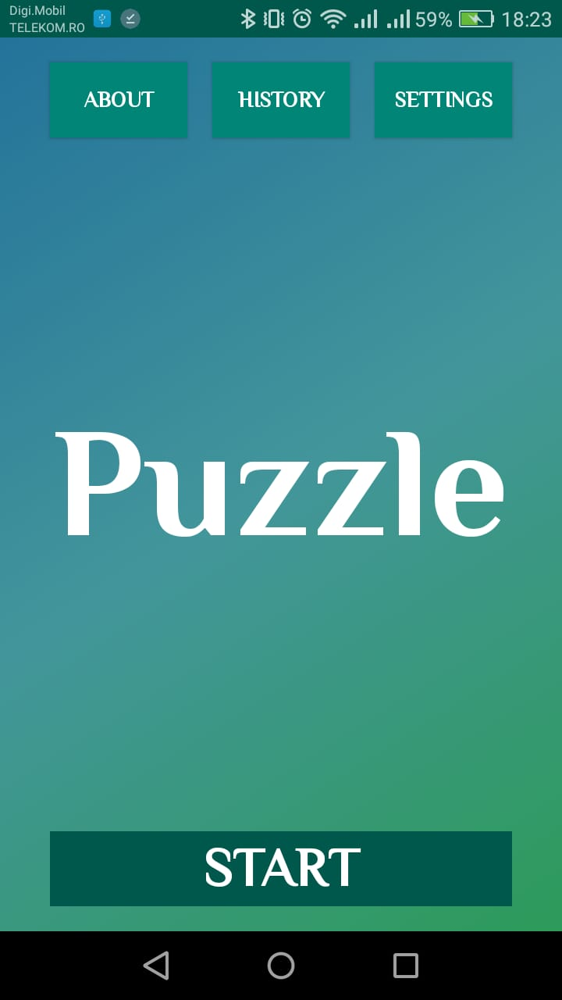
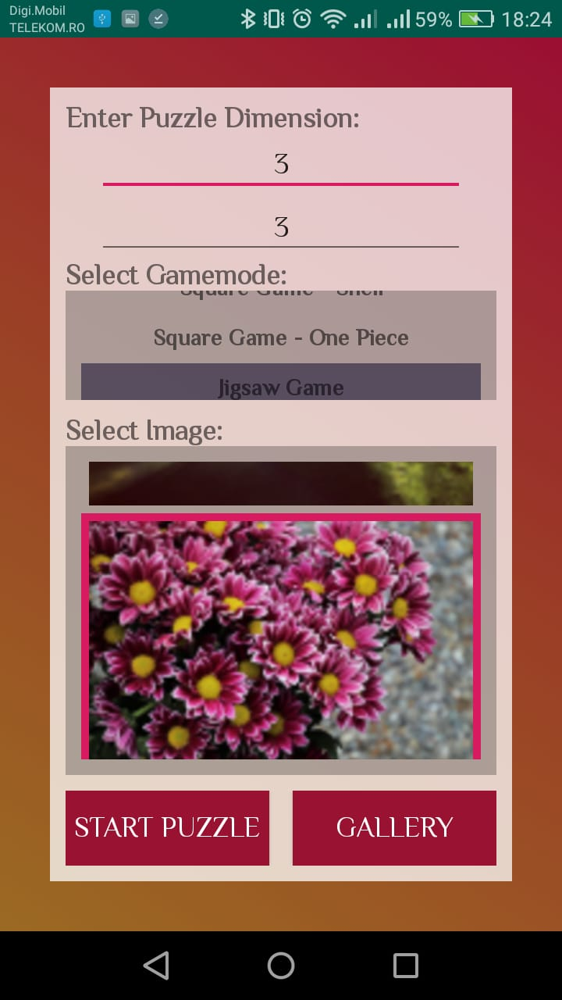
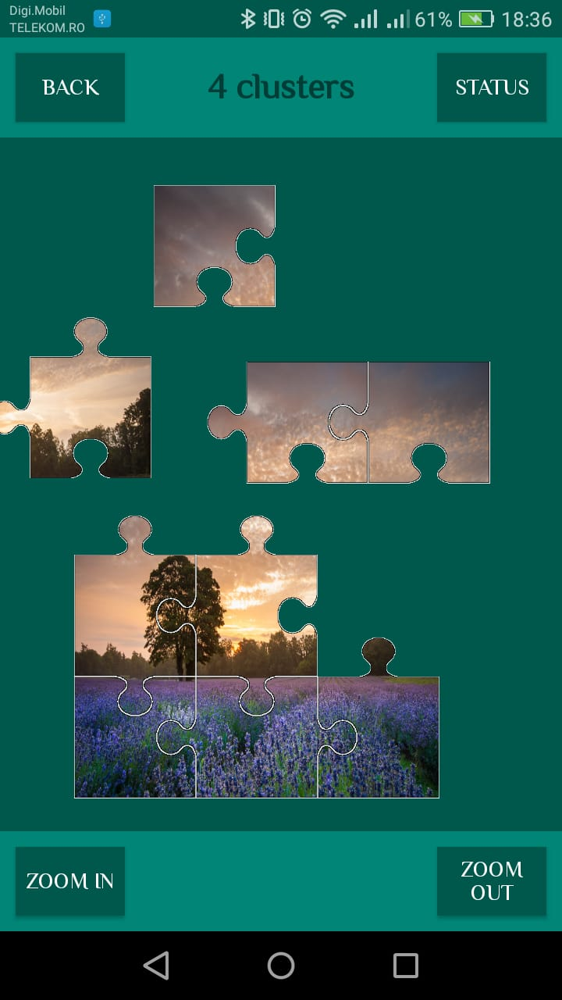
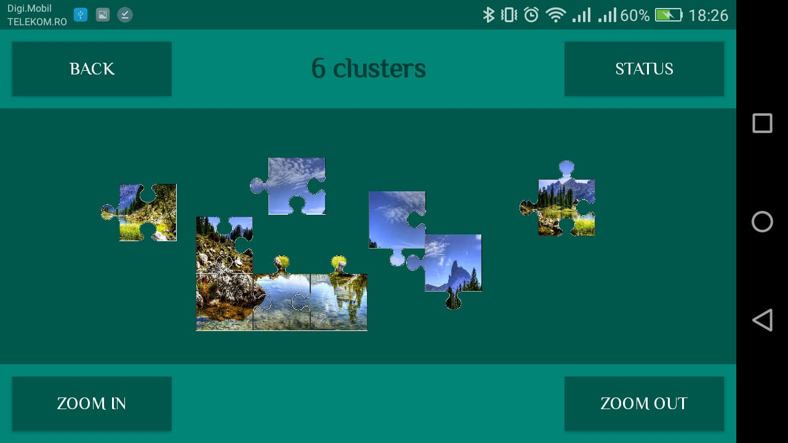
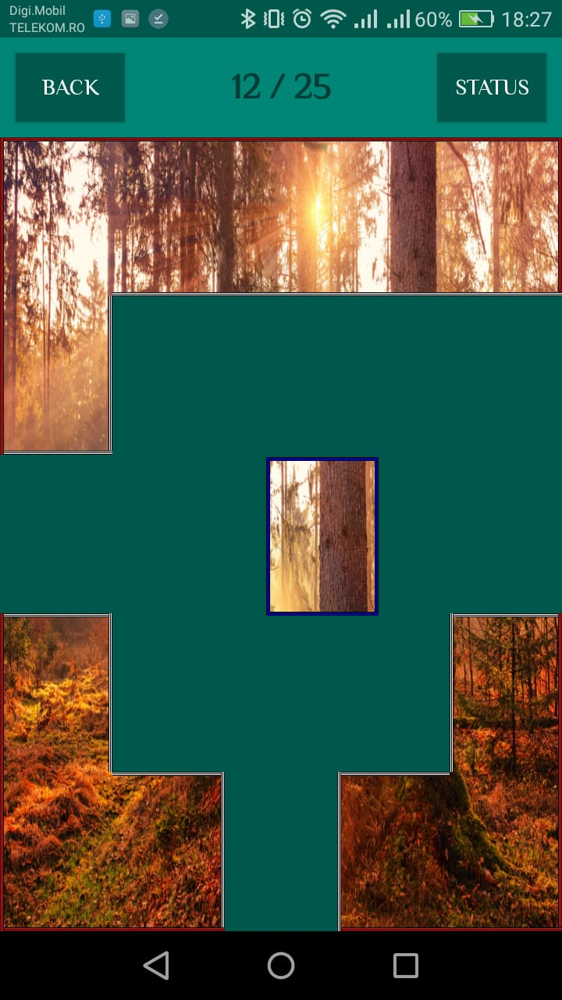
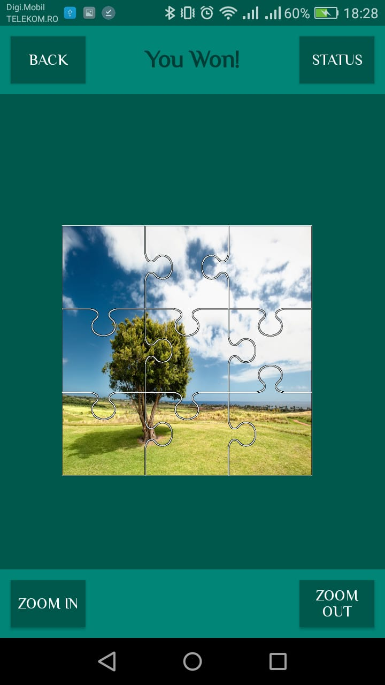
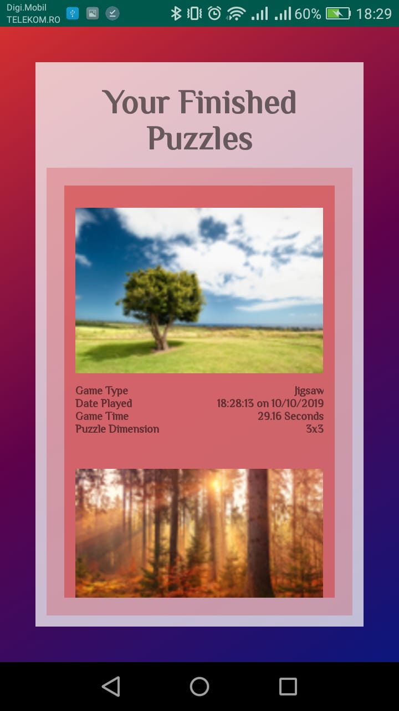

This is a team project made for the MDS course at the University of Bucharest, Faculty of Mathematics and Computer Science.

Students:
- Burcea Bogdan-Madalin
- Mocanu Alexandru
- Sotir Anca-Nicoleta

How to play each Game Mode:
1. Jigsaw Game: A classic jigsaw game, all pieces must be connected to form the full image.
2. Square Game - Simple: Pieces are rectangular and they must be placed in their correct spot without restriction.
3. Square Game - Shell: Similar to the simple mode, but a piece can only be placed if it\'s adjacent to an already placed piece or to the margin.
4. Square Game - One piece: Similar to the simple mode, but the corners are already fixed. One at a time, a new neighbouring piece will appear on the screen and it must be placed in its correct spot.

The player wins when the full image is formed, no matter the game mode.

Also, before each game, the player must choose:
- the puzzle dimensions by entering row and column number
- a game mode from the list
- an image, either from the default image list or from the personal gallery

Screenshots: 

